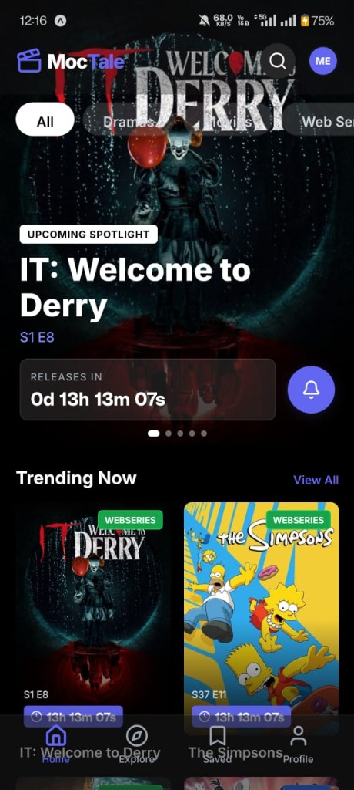
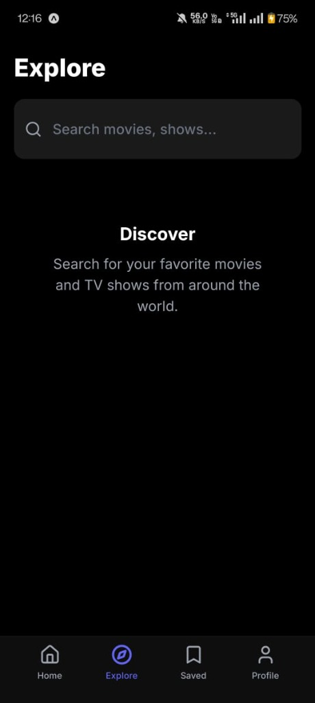
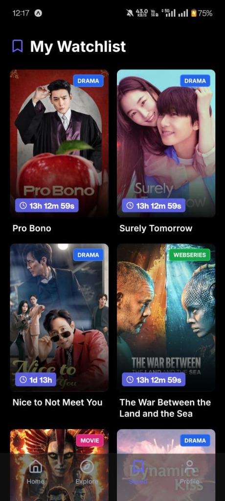
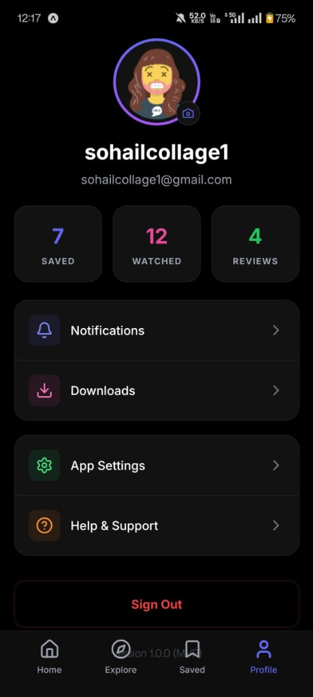

# Moctale - TV Show Tracker & Discovery

**Moctale** is a premium, beautifully designed mobile application for discovering, tracking, and getting notified about your favorite Asian dramas and movies. Built with React Native, Expo, and Supabase.

# ⚠️ IMPORTANT: DNS CONFIGURATION
**For the app to fetch data correctly, you MUST set your phone's Private DNS to `dns.google` or use Google DNS.**
1. Go to Settings > Network & Internet > Private DNS.
2. Select "Private DNS provider hostname".
3. Enter `dns.google` and save.

<p align="center">
  <a href="./releases/moctale.apk">
    
  </a>
</p>

<p align="center">
  
  
  
  
</p>

## ✨ Features

-   **🎬 Massive Library**: Discover trending Korean, Chinese, and other Asian dramas and movies.
-   **🔍 Smart Search**: dedicated Explore tab to find exactly what you're looking for.
-   **☁️ Cloud Sync**: Seamlessly sync your watchlist across devices using **Supabase**.
-   **🔔 Push Notifications**: Get notified 10 minutes before your favorite show airs via the "Notify Me" feature.
-   **👤 User Profiles**: Track your viewing stats (Saved, Watched) and see your membership status.
-   **🎨 Premium UI**: A stunning dark-themed interface with gradients, glassmorphism, and smooth animations.

## 🛠 Tech Stack

-   **Frontend**: React Native, Expo (SDK 50+)
-   **Backend**: Supabase (PostgreSQL, Auth, RLS)
-   **Styling**: Custom Design System (Dark Theme, Gradients)
-   **Icons**: Lucide React Native
-   **Notifications**: Expo Notifications

## 🚀 Getting Started

### Prerequisites

-   Node.js (LTS)
-   Expo CLI (`npm install -g eas-cli`)
-   Supabase Account

### Installation

1.  **Clone the repository**
    ```bash
    git clone https://github.com/Sohail-Ansari-afk/Moctale-TvShow-Tracker.git
    cd Moctale-TvShow-Tracker
    ```

2.  **Install dependencies**
    ```bash
    npm install
    ```

3.  **Run the app**
    ```bash
    npx expo start
    ```

## 📱 Build The APK

To generate an Android APK for your device:

```bash
eas build --profile development --platform android --local
```

## 🔐 Supabase Setup

The app connects to a Supabase backend. The schema includes:
-   `profiles`: User data
-   `watchlist`: Saved shows
-   `contents`: Cached show metadata

*(Note: API keys are currently configured in `src/lib/supabase.js`. For production, migrate these to environment variables.)*

## 🤝 Contributing

Contributions are welcome! Please feel free to submit a Pull Request.

1.  Fork the Project
2.  Create your Feature Branch (`git checkout -b feature/AmazingFeature`)
3.  Commit your Changes (`git commit -m 'Add some AmazingFeature'`)
4.  Push to the Branch (`git push origin feature/AmazingFeature`)
5.  Open a Pull Request

## 📄 License

Distributed under the MIT License.
